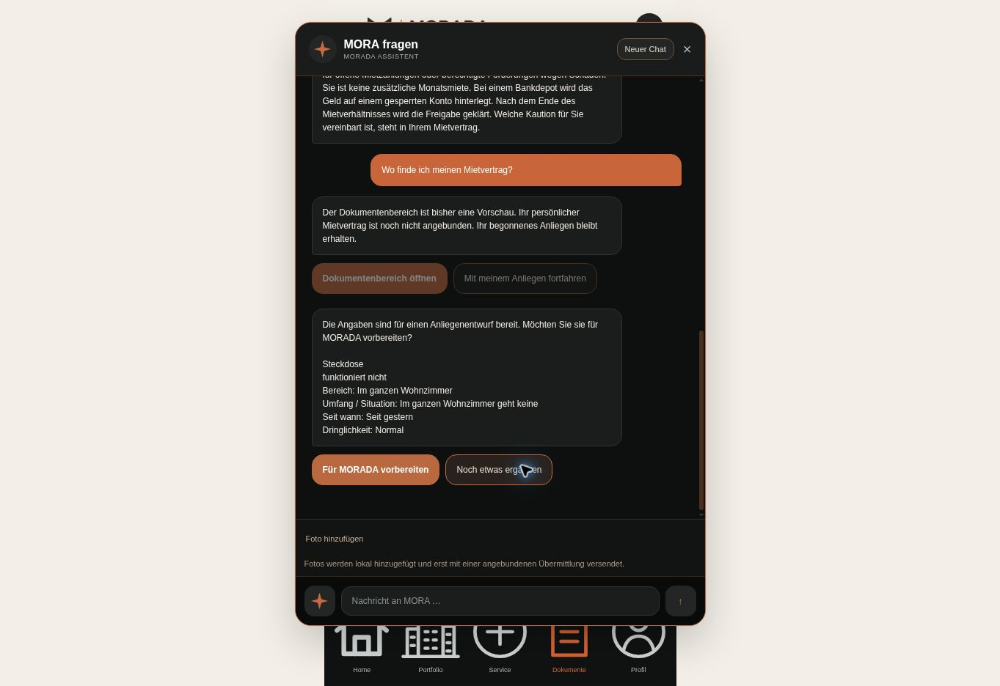

# MORA 2.0 – Umsetzung und Prüfbericht

Stand: 7. Oktober 2026. Auftrag: natürliche Gesprächsführung, Korrekturen, getrennte Anliegen, passende Aktionen und toleranter Umgang mit Tippfehlern im bestehenden MORADA Portal.

**Die neue Gesprächsarchitektur ist implementiert. Der produktive Zugriff auf das Sprachmodell ist weiterhin blockiert.** Der aktuelle Gateway-Aufruf antwortet mit `403 customer_verification_required`. MORA verwendet deshalb die ausdrücklich begrenzte geführte Erfassung. Deren Ergebnisse sind kein Nachweis für freies semantisches KI-Verständnis.

Dieser Bericht unterscheidet die Status **«implementiert und getestet»**, **«implementiert, noch nicht vollständig getestet»**, **«technisch vorbereitet»** und **«nicht umgesetzt»**. Tests mit simulierten Modell- oder Backendantworten werden ausdrücklich als solche bezeichnet. Der abschliessende lokale Gesamtlauf und die Liveprüfung sind in Abschnitt 9 dokumentiert, die Bereitstellungsevidenz in Abschnitt 12.

## 1. Wie funktionierte MORA vorher?

Die unmittelbar vorherige Version besass bereits einen serverseitigen KI-SDK-Aufruf, signierten Gesprächszustand, strukturierte Antworten und lokale Anliegenentwürfe. Der Modellzugriff scheiterte jedoch an der Anbieterfreigabe. Tatsächlich antwortete dadurch überwiegend eine geführte Logik mit Wortlisten, einfacher Tippfehlertoleranz und festen Rückfragen pro Kategorie.

Ein Gespräch führte einen aktiven Vorgang. Die Logik kannte Kategorien wie `electricity` und `heating`, aber keinen verbindlichen separaten Typ für das betroffene Gerät. Sie bot wiederholt Standardaktionen an und konnte manche freien Folgeantworten dem gerade erwarteten Feld zuordnen, obwohl sie eine andere Information enthielten.

## 2. Warum wurden Steckdosen und Lampen verwechselt?

Die Ursache lag in der Modellierung: Steckdose, Lampe und Stromausfall gehörten gemeinsam zur Kategorie `electricity`. `questionFor()` wählte für diese gesamte Kategorie die feste Frage «Ist nur diese Lampe betroffen oder funktionieren mehrere Leuchten nicht?» samt Lampenauswahl. Die korrekte Erkennung von «Steckdose» als elektrisches Problem konnte diesen Fehler daher nicht verhindern.

Jetzt sind **Kategorie, konkrete Einrichtung und Defekt getrennte Felder**. `equipment:socket` erhält Steckdosenfragen, `equipment:light` Lampenfragen und `equipment:switch` Schalterfragen. Dasselbe Schema gilt für die Modellantwort und die geführte Ausfalllogik. Der Fehler wurde damit an der gemeinsamen Daten- und Fragelogik behoben.

Status: **implementiert und getestet** durch Geräte-, Dialog- und Korrekturprüfungen.

## 3. Welche Komponenten wurden geändert?

| Datei / Bereich | Änderung |
| --- | --- |
| `lib/mora/equipment.js` | Gemeinsame Einrichtungstypen, Bezeichnungen und Zuordnung zu Kategorien. |
| `lib/mora/schema.js` | Strikte Verträge für Einrichtung, Anzahl, Defekt, Korrekturen, weitere Anliegen, Wissensfragen und Kundeneingaben. |
| `lib/mora/guided.js` | Ausgelagerte begrenzte Erfassung mit Tippfehlertoleranz, Schweizer Begriffen, unabhängiger Feldextraktion und Rückfragen bei Unsicherheit. |
| `lib/mora/understanding.js` | Erweiterter Modellauftrag, strukturierte Ausgabe und begrenzter Kontext; Datenaufbewahrung beim OpenAI-Aufruf mit `store:false` deaktiviert. |
| `lib/mora/engine.js` | Mehrere getrennte Anliegen, Korrekturen, konkrete Gerätefragen, Themenwechsel und Sicherheitspriorität. |
| `lib/mora/actions.js` | Wiederverwendbare, validierte Action-Typen und erlaubte Parameter. |
| `lib/mora/knowledge.js` | Geprüfte allgemeine Erklärung der Mietkaution ohne unnötige Aktionen. |
| `lib/mora/safety.js` | Gefahrenerkennung mit begrenzten Tippfehlervarianten, Negationen, hypothetischen Aussagen und ausdrücklichen Korrekturen. |
| `lib/mora/session.js` | Komprimierter, signierter Zustand; aktives Anliegen nur einmal gespeichert; begrenzte Grösse und stabiler Signaturschlüssel im Vercel-Betrieb. |
| `api/chat.js` | Rückgabe aller Anliegen und klarer Fehler beim Erreichen der Gesprächsgrenze. |
| `api/requests.js` | Vorbereitete serverseitige Berechtigungsprüfung, Vorgangsschlüssel und Bestätigung ausschliesslich nach gültiger Speicherquittung. |
| `assets/mora-client.js` | Anliegenauswahl, passende Aktionen, Erhalt von Fotos und Entwürfen, Schutz manuell bearbeiteter Entwurfsfelder und aktualisierte Zusammenfassungen. |
| `assets/mora.css`, `index.html` | Ergänzte Bedienung und responsive Elemente innerhalb des vorhandenen Chatdesigns. |
| `tests/*.test.js` | Regressionen für vollständige Dialoge, Oberfläche, Sicherheitsfälle, Modellvertrag, Sitzungen und vorbereitete Übermittlung. |

Die bestehende Portalstruktur und der Adapter `lib/portal/adapter.js` werden weiterverwendet. Eine echte Datenbank- oder Kundenintegration wurde nicht durch Demo-Daten ersetzt.

## 4. Ist jetzt ein echtes LLM angebunden?

Status: **implementiert, noch nicht vollständig getestet**. Ein echter serverseitiger Aufruf ist eingebaut, ein erfolgreicher produktiver Modellaufruf ist bislang nicht nachgewiesen.

Der bevorzugte Weg führt über Vercel AI Gateway und deploymentgebundene OIDC-Authentifizierung. Standardmodell ist `openai/gpt-6-luna`, über `AI_GATEWAY_MODEL` konfigurierbar. Der direkte OpenAI-Weg wird in einer Umgebung ohne Gateway-Authentifizierung über `OPENAI_API_KEY` verwendet; Standard ist `gpt-5.4-mini`, über `OPENAI_MODEL` konfigurierbar.

Die Implementierung verwendet AI SDK `generateText` mit `Output.object`, Zod-Validierung, einer begrenzten Wartezeit und kontrollierter Ausfallbehandlung. Das Modell liefert Daten und gegebenenfalls eine Rückfrage; es führt keine Portalaktionen aus. SDK-Vertragstests verwenden einen simulierten Modellprovider.

Der aktuelle Liveversuch scheitert mit `403 customer_verification_required`. Der direkte OpenAI-Zugang lieferte bei der früheren Prüfung `429`; daraus folgt keine Aussage über seinen heutigen Abrechnungsstatus. Die erforderliche Kundenverifizierung im Vercel-Team muss abgeschlossen werden. Danach sind reale Modellgespräche und Qualitätsprüfungen erforderlich. Es wurden weder Guthaben gekauft noch Zahlungsdaten geändert.

## 5. Wie funktionieren Kontext, Korrekturen und Themenwechsel?

Status: **implementiert und getestet** für die automatisiert geprüften Dialoge und die geführte Erfassung; freies Modellverständnis bleibt wegen Abschnitt 4 ungeprüft.

Bis zu acht Anliegen erhalten eigene IDs und getrennte Felder für Einrichtung, Defekt, Ort, Anzahl, Beginn, Umfang, Dringlichkeit, Fotos und Zusatzangaben. Die Oberfläche lässt zwischen ihnen wechseln. Eine neue Information wird unabhängig von der zuletzt gestellten Frage ausgewertet: «Alle» kann den Heizungsumfang ergänzen, obwohl zuvor nach dem Beginn gefragt wurde.

«Nein, zwei» ersetzt die Anzahl im bestehenden Anliegen. Eine ausdrückliche Gerätekorrektur korrigiert den bisherigen Vorgang. Frühere Kundenaussagen bleiben als begrenzter Verlauf erhalten; die Zusammenfassung verwendet die aktuellen strukturierten Angaben. Bei einem ausdrücklich zusätzlichen Problem wird ein eigener Vorgang angelegt. Die geführte Erfassung trennt mehrere eindeutig erkennbare Probleme; beliebig verschachtelte Freitexte sind ohne Sprachmodell weiterhin begrenzt.

Ein Ausflug zu Dokumenten oder allgemeinen Wissensfragen löscht das begonnene Anliegen nicht. Danach kann die Erfassung fortgesetzt werden. Unklare Beschreibungen wie «das Ding unter dem Lavabo» führen zu einer Rückfrage statt zu einer erfundenen Diagnose.

## 6. Wann werden Buttons erzeugt und wie werden sie geprüft?

Status: **implementiert und getestet**.

Die Engine erzeugt strukturierte Aktionen aus dem Gesprächszustand. Einfache Umfangsfragen erhalten passende Auswahlmöglichkeiten. Eine freie Rückfrage oder allgemeine Erklärung benötigt keine Buttons. Eine abschliessende Erfassung bietet «Für MORADA vorbereiten» und «Noch etwas ergänzen» an. Freitext bleibt jederzeit möglich. Fotos und Entwurfsvorbereitung sind ergänzend über die Anliegenbedienung erreichbar, ohne dieselben Aktionen doppelt anzuzeigen.

`actions.js` validiert Typ, ID, Beschriftung und Parameter, begrenzt die Anzahl auf vier und verbietet doppelte IDs. Der Server akzeptiert Auswahlaktionen nur aus dem signierten Zustand; ein Anliegenwechsel muss auf eine darin vorhandene ID verweisen. Navigation ist auf erlaubte Portalbereiche begrenzt, Telefonaktionen auf `112`. Vom Modell vorgegebene beliebige URLs, Funktionsnamen oder Datenbankbefehle sind nicht zulässig.

Die Oberfläche rendert alle erlaubten Aktionen über eine gemeinsame Komponente. Frühere Auswahlbuttons werden nach einer neuen Antwort deaktiviert, auch nach erneutem Laden.

## 7. Welche Portalaktionen funktionieren tatsächlich?

| Funktion | Status | Tatsächliches Verhalten |
| --- | --- | --- |
| Freitext, Auswahlantworten und getrennte Anliegen | **implementiert und getestet** | Angaben werden dem jeweiligen Chatvorgang zugeordnet. |
| Lokalen Anliegenentwurf vorbereiten und bearbeiten | **implementiert und getestet** | Übernahme ohne erneute Eingabe; eigene Änderungen bleiben erhalten, Konflikte werden angezeigt. |
| Foto hinzufügen, entfernen, wieder laden und exportieren | **implementiert und getestet** | Dateien bleiben lokal im Browser. Keine automatische Bilddiagnose und kein Upload. |
| Entwurf herunterladen | **implementiert und getestet** | Lokaler Export mit den verfügbaren Angaben und Fotos. |
| Portalbereich für Dokumente, Portfolio oder Entwürfe öffnen | **implementiert und getestet** | Navigation in die vorhandene Oberfläche; kein behaupteter Zugriff auf echte Kundenakten. |
| Mietkaution allgemein erklären | **implementiert und getestet** | Kurze allgemeine Erklärung ohne unnötige Buttons. |
| Tatsächlich an MORADA übermitteln | **technisch vorbereitet** | Produktiver Adapter ist getrennt; Antwort `503 integration_required`, keine Versandbestätigung. |
| Echte Dokumente, Mietverträge, Termine oder Bearbeitungsstände abrufen | **nicht umgesetzt** | Es bestehen noch keine angebundenen kundenspezifischen Datenquellen. |
| Terminänderung ausführen, Handwerker beauftragen oder Kosten freigeben | **nicht umgesetzt** | Änderungswünsche können nur als Anliegen vorbereitet werden. |
| Kundenübergreifende Anmeldung und Berechtigungen | **technisch vorbereitet** | Prüfschnittstelle vorhanden, aber keine produktive Kundenidentität angeschlossen. |

## 8. Datenschutz, Berechtigungen und Sicherheit

Die technische Begrenzung von Eingaben, Zustand und Aktionen ist **implementiert und getestet**. Die produktive Kundenautorisierung ist **technisch vorbereitet**.

API-Schlüssel verbleiben auf dem Server. Der Modellkontext enthält eine erlaubte Auswahl aktueller Felder und begrenzte Gesprächshistorie, keine Bilddateien, Foto-Metadaten oder vollständigen Korrekturarchive. `store:false` wird auch für den OpenAI-Weg über Gateway mitgegeben. Dies ist keine Zusicherung, dass sämtliche Anbieterprotokolle oder vertraglichen Aufbewahrungspflichten entfallen.

Der Zustand ist mit HMAC signiert, komprimiert und zwölf Stunden gültig. **Eine Signatur ist keine Verschlüsselung und keine Kundenanmeldung.** Im Vercel-Betrieb muss ein stabiler Signaturschlüssel verfügbar sein; bei reinem OIDC-Zugang wird dafür `MORA_SESSION_SECRET` benötigt. Logs enthalten bereinigte Fehlercodes statt Chattexte, Tokens oder Anbieterantworten. API-Antworten werden mit `Cache-Control: no-store` ausgeliefert. Texte erscheinen über `textContent`.

Für die spätere Übermittlung verweigert die vorbereitete Schnittstelle fehlende serverseitige Berechtigung vor jedem Schreibzugriff. Erst ein ausdrücklich bestätigter Backendbeleg mit Vorgangs-ID darf als Erfolg erscheinen. Die zugrunde liegende Kunden- und Einheitenprüfung muss noch real angebunden werden; ein signierter Chat allein berechtigt niemanden zu fremden Daten.

Eindeutige akute Gefahren werden lokal geprüft, ohne auf das Modell zu warten. Auch eine durch das Modell erkannte Gefahr hat Vorrang vor einer widersprüchlichen Themenzuordnung. Negationen und ausdrückliche Korrekturen werden berücksichtigt; Unsicherheit oder eine zwischenzeitliche Beruhigung wird nicht automatisch als sichere Entwarnung behandelt. Die Hinweise enthalten keine riskanten Reparaturanleitungen. Kostenpflichtige Arbeiten werden nicht ausgelöst.

## 9. Dialogtests, Build, Lint und Typecheck

Die automatisierten Prüfreihen decken die geforderten Fälle A–L ab:

| Fall | Prüfziel |
| --- | --- |
| A / E | Steckdosenfrage und freie Antwort «Im ganzen Wohnzimmer geht keine», ohne Lampenverwechslung. |
| B | Drei Steckdosen, Wohnzimmer und «seit gestern» werden aus einer Nachricht extrahiert und nicht erneut abgefragt. |
| C | «Heizung kaputt» → «Alle» → «Seit gestern» behält Umfang und Beginn getrennt. |
| D / H | Wissensantwort ohne unnötige Aktionen; Dokumentenausflug erhält das begonnene Anliegen. |
| F | Heizung und Wasserproblem haben getrennte IDs, Orte, Folgeantworten und Fotos. |
| G | Funken und Brandgeruch lösen vorrangig Sicherheitshinweise aus. |
| I | Ein unbekanntes geräuschvolles Teil unter dem Lavabo wird nicht als bestimmtes Gerät erfunden. |
| J | Lokale Übernahme funktioniert; fehlende echte Anbindung wird ehrlich gemeldet. Ein zukünftiger Erfolgsbeleg wird nur mit simuliertem autorisiertem Backend getestet. |
| K | Korrekturen von Anzahl, Ort oder Einrichtung aktualisieren den richtigen Vorgang. |
| L | Häufige Tippfehler, Schweizer Ausdrücke, längere Eingaben und unklare Antworten. |

Weitere Regressionen prüfen manipulierte und abgelaufene Sitzungen, nicht erlaubte Modellfelder, fremde Anliegen-IDs, veraltete Buttons, Mehrfachklicks, Offlinefehler, Fotos, Entwurfsänderungen, fehlende Backendbestätigung, lange Gespräche sowie Gas-, Feuer-, Elektro- und Wasserhinweise einschliesslich Negationen.

**Abschliessende lokale Prüfevidenz: 134 von 134 Tests bestanden.** Typecheck, projektspezifischer Lint und Build bestanden ebenfalls. `git diff --check` meldete keine Formatfehler.

| Befehl | Abschliessendes Ergebnis |
| --- | --- |
| `npm test` | Bestanden: 134 Tests, keine fehlgeschlagenen Tests. |
| `npm run typecheck` | Bestanden; TypeScript prüft die JavaScript-Quellen mit `checkJs`. |
| `npm run lint` | Bestanden; projektspezifische Syntax- und Assetprüfung, kein zusätzlich eingeführtes ESLint-Regelwerk. |
| `npm run build` | Bestanden; erstellt statische Portaldateien in `dist`, Serverrouten verbleiben unter `api`. |
| `git diff --check` | Bestanden; keine Formatfehler im Diff. |

Zusätzlich wurden die Fälle **A–L auf der veröffentlichten Produktion bestanden: 12/12 Fälle, 33 HTTP-Aufrufe im abschliessenden Lauf, keine fehlgeschlagene Assertion**. Der Übermittlungsendpunkt antwortete korrekt mit `503`, `accepted:false` und `integration_required`. Ausschliesslich synthetische Testdaten wurden verwendet. Die tatsächlichen Antwortmodi waren `guided` und `safety`; Gateway meldete weiterhin `403 customer_verification_required`.

Ein bestandener Vertragstest mit simuliertem Modell bestätigt Schema und Verarbeitung, nicht die Antwortqualität eines echten Sprachmodells.

## 10. Desktop, Mobile, PWA und bestehendes Portal

DOM-Tests mit Desktop- und Mobilkonfigurationen von 1280 und 390 Pixeln sind **implementiert und getestet**. Sie bedienen das tatsächliche Chatformular, Aktionen, Anliegenwechsel, Fotos und vorausgefüllte Serviceentwürfe. Prüfungen kontrollieren weiterhin vorhandene Portalnavigation, Iconpfade und responsive Bedienelemente.

Die **visuelle Desktopprüfung ist implementiert und getestet** in Chrome auf der öffentlichen Produktion. Geprüft wurden der bestehende Demo-Zugang, das Öffnen des Chats, «steckdose kaput», die freie Folgeantwort zum ganzen Wohnzimmer, «Seit gestern», die vorausgefüllte Übernahme, eine manuelle Ergänzung, lokales Speichern und erneutes Laden. Der gespeicherte Entwurf und die Ergänzung blieben erhalten. Die Mietkautionsfrage wurde ohne Antwortbuttons beantwortet; der Dokumentenausflug und die Rückkehr behielten die Steckdosendaten. Das dunkle Chatdesign, die Aktionsfarben, Zeilenumbrüche und Bedienelemente wurden visuell kontrolliert. In den erfassten Browserlogs gab es keine Fehler aus der Portal-Anwendung; Meldungen einer Browsererweiterung wurden davon getrennt.

Eine reale Prüfung auf iPhone/Safari und als installierte PWA ist **nicht umgesetzt**. DOM-Tests beweisen keine korrekte mobile Bildschirmdarstellung, Bildschirmtastatur, Installation oder Safari-Dateiauswahl. Ebenso besteht noch keine produktive Kundenanmeldung, deren echten End-to-End-Ablauf man bestätigen könnte.

## 11. Offene Einschränkungen

Der entscheidende offene Punkt ist die Anbieterfreigabe. Solange sie fehlt, kann MORA häufige geprüfte Formulierungen und Tippfehler verarbeiten, aber keine beliebige Sprache zuverlässig verstehen. Eine grössere Wortliste ersetzt kein erfolgreich betriebenes Sprachmodell.

Die geführte Erfassung bleibt bei seltenen Schreibweisen, verschachtelten Mehrfachproblemen und mehrdeutigen Bezugnahmen begrenzt. Auch nach Freischaltung ist korrekte Modellantwortqualität anhand realer Dialoge zu prüfen. Anhänge werden nicht inhaltlich ausgewertet. Entwürfe und Fotos sind an den Browser gebunden, ohne geräteübergreifende Synchronisierung. Es gibt maximal acht Anliegen pro Unterhaltung und begrenzte Eingabe- und Verlaufsgrössen.

Echte Kundenidentität, dauerhafte Vorgangsablage, internes MORADA-Postfach, Kundendokumente, Terminbestand, Bearbeitungsstatus und Benachrichtigungen fehlen. Schutz vor Missbrauch des öffentlich erreichbaren Modellendpunkts, Produktionslimits und das betriebliche Datenschutzkonzept müssen vor dem Einsatz mit echten Kunden vervollständigt werden. Die fehlende Safari/PWA-Prüfung bleibt separat offen.

## 12. Repository, Branch, Commit und Deployment

| Nachweis | Stand dieser Berichtsfassung |
| --- | --- |
| Repository | `dianaporschke/morada.mora.ai` |
| Arbeitsbranch | `main` |
| Ausgangscommit | `220a28b` – dies ist ausdrücklich nicht der Abschlusscommit der neuen Änderungen. |
| Implementierungscommit | `236aba11d596176fe688622b087e16bf43b19bf8` |
| Geprüftes Implementierungsdeployment | `dpl_CuCNxjGoD6wzUFCfPzagH2JneqDM`, Produktion, Zustand `READY` |
| Unveränderliche Deployment-Adresse | https://morada-mora-dojc79f1y-dianaporschke-1255s-projects.vercel.app/ – Vorschauzugang kann Vercel-Anmeldung verlangen. |
| Öffentlich geprüfter Deployment-Link | https://morada-portal.vercel.app/ – beim API- und Browserlauf nachweislich dem obigen Commit zugeordnet. |

Code wurde über die verbundene GitHub-Schnittstelle auf `main` gesichert; der hochgeladene Git-Baum entsprach exakt dem lokal geprüften Baum. Vercel hat daraus automatisch die Produktion gebaut. Der nachfolgende Nachweiscommit ergänzt ausschliesslich diesen Bericht und das Bildschirmfoto; der geprüfte Anwendungscode bleibt unverändert.

## 13. Konkrete nächste Schritte für Phase 2

1. **KI-Zugang freischalten und messen:** Vercel-Verifizierung abschliessen, echte Modellantwort prüfen und die Dialoge A–L samt weiteren unbekannten Formulierungen gegen den Liveprovider ausführen. Ausfallverhalten, Antwortzeiten und Kostenbegrenzung prüfen.
2. **Kundenkontext anbinden:** Echte Anmeldung und serverseitige Zuordnung von Kunde, Immobilie, Einheit und Berechtigung umsetzen. Diesen Kontext aus vertrauenswürdigen Serverdaten ableiten.
3. **Vorgänge dauerhaft speichern:** Autorisierten Adapter mit Datenbank, stabilen Vorgangs-IDs, Idempotenz und bestätigten Speicherquittungen verbinden. Lokale Bearbeitungen kontrolliert übernehmen. Erst dann die tatsächliche Übermittlung freigeben.
4. **Fotos hochladen:** Authentifizierte, auf den jeweiligen Vorgang begrenzte Uploads mit Dateiprüfung, Aufbewahrung und Löschablauf implementieren. Erst nach bestätigtem Upload den Status ändern.
5. **Dokumente und Termine integrieren:** Berechtigte Datensätze abrufen, passende Öffnen-Aktionen bereitstellen und Terminänderungen als bestätigten Prozess abbilden. Modellantworten an tatsächlich verfügbare Daten binden.
6. **Interne MORADA-Bearbeitung aufbauen:** Zuständigkeit, Triage, Rückfragen, Handwerkerkoordination, Statuswechsel und ausdrückliche Kostenfreigaben mit nachvollziehbarer Historie verbinden.
7. **Status und Benachrichtigungen ergänzen:** Nur bestätigte Backendzustände anzeigen und autorisierte Kunden über relevante Änderungen informieren.
8. **Betrieb vollständig prüfen:** Visuelle Desktop- und echte iPhone/Safari/PWA-Tests, Berechtigungsgrenzen, Anbieter- und Backendausfälle sowie Datenschutz-, Lösch- und Missbrauchsschutz mit dem produktiven Ablauf prüfen.

Diese Integrationen sind **technisch vorbereitet**, soweit bereits Schemas und Adaptergrenzen existieren; die produktiven Datenquellen und Abläufe sind **nicht umgesetzt**. Ihre Aktivierung erfolgt erst nach einer realen Verbindung und Prüfung.
